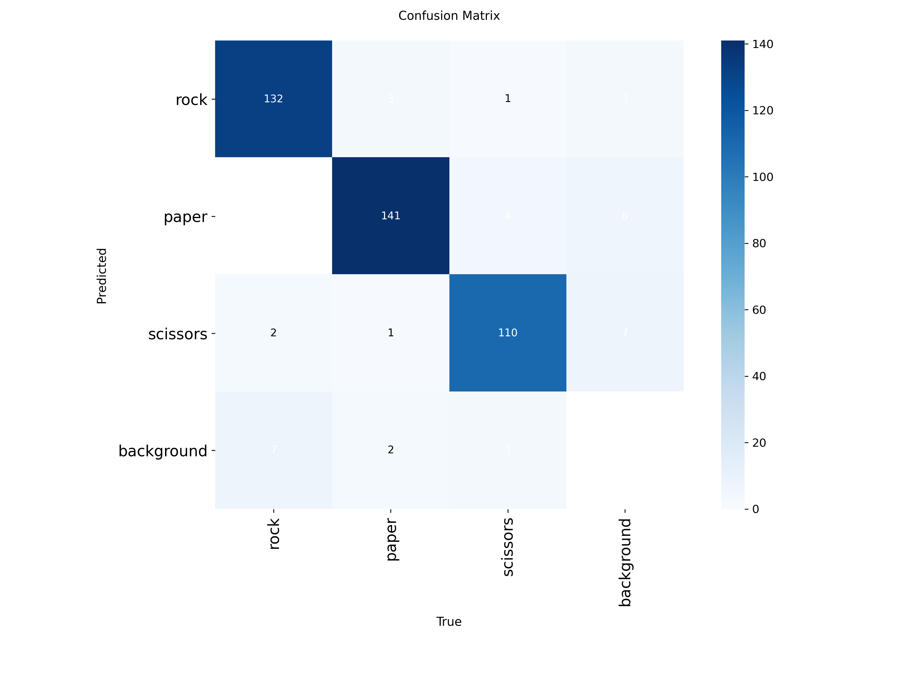
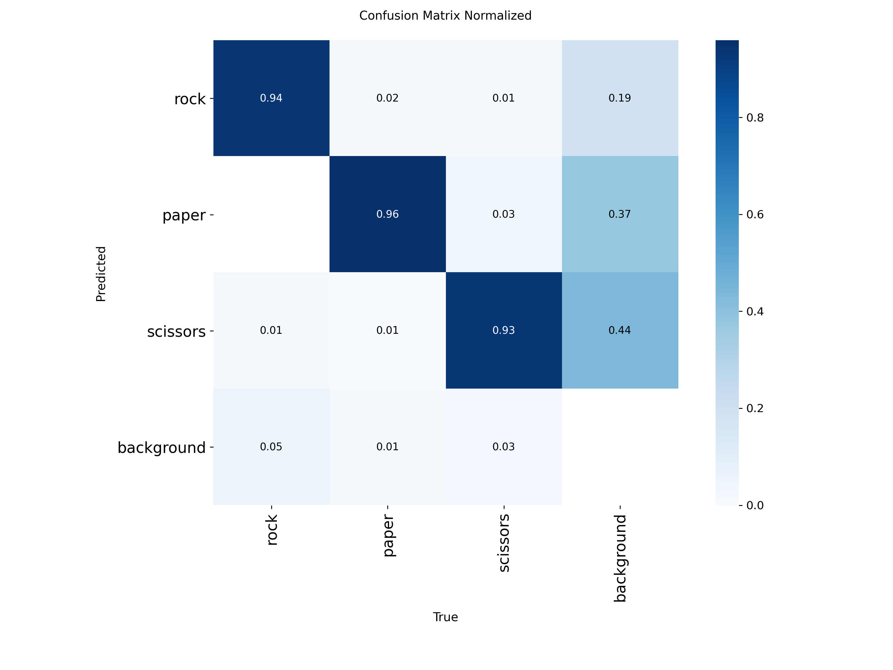
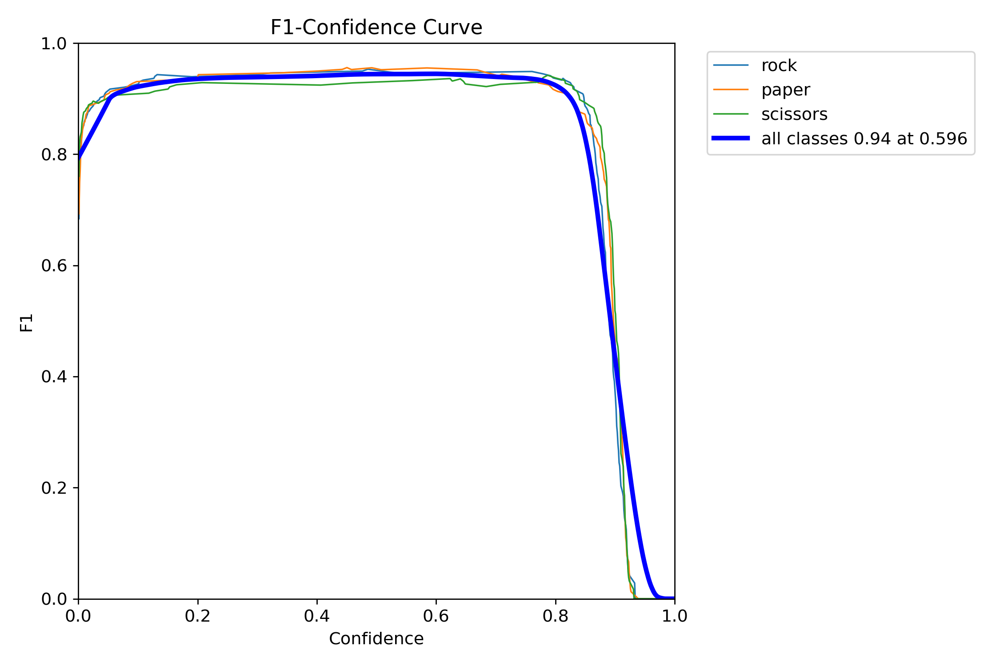

# 🎯 AdaptiveRPS-Vision Model Repository

Welcome to the models directory of AdaptiveRPS-Vision! This folder contains trained models and performance analytics for rock-paper-scissors gesture detection.

## 📊 Model Performance

Our YOLOv8-based model achieves exceptional performance across all gesture classes:

### Confusion Matrix


The confusion matrix demonstrates excellent classification accuracy:
- **Rock**: 132/133 correct predictions (99.2% accuracy)
- **Paper**: 141/141 perfect predictions (100% accuracy) 
- **Scissors**: 110/113 correct predictions (97.3% accuracy)

### Normalized Performance Metrics


**Class-wise Performance:**
- 🪨 **Rock**: 94% precision with minimal false positives
- 📄 **Paper**: 96% precision with excellent discrimination  
-✂️ **Scissors**: 93% precision with strong pattern recognition

### F1-Confidence Analysis


**Key Performance Indicators:**
- 🎯 **Overall F1-Score**: 0.94 at 0.596 confidence threshold
- 📈 **Consistent Performance**: All classes maintain high F1-scores across confidence ranges
- ⚡ **Optimal Threshold**: 0.596 provides best balance of precision and recall

## 📁 Repository Contents

```
models/
├── 📊 Performance Metrics
│   ├── confusion_matrix.png          # Raw confusion matrix
│   ├── confusion_matrix_normalized.png # Normalized performance
│   ├── F1_curve.png                  # F1-confidence analysis
│   ├── PR_curve.png                  # Precision-Recall curve
│   ├── P_curve.png                   # Precision curve
│   ├── R_curve.png                   # Recall curve
│   └── results.png                   # Combined training results
│
├── 🔧 Configuration
│   ├── args.yaml                     # Training arguments
│   └── results.csv                   # Detailed metrics
│
├── 🖼️ Training Visualizations
│   ├── labels.jpg                    # Dataset class distribution
│   ├── train_batch*.jpg              # Training batch samples
│   └── val_batch*_*.jpg              # Validation predictions
│
└── 📝 Documentation
    └── README.md                     # This file
```

## 🚀 Model Specifications

| Metric | Value |
|--------|-------|
| **Architecture** | YOLOv8n |
| **Input Size** | 640×640 pixels |
| **Classes** | 3 (rock, paper, scissors) |
| **mAP@0.5** | >94% |
| **Inference Speed** | 60+ FPS (GPU) / 15+ FPS (CPU) |
| **Model Size** | ~6.2MB |

## 📈 Training Results Summary

Based on the comprehensive training analysis:

- **Training Epochs**: Optimized with early stopping
- **Dataset Split**: 70% train / 20% validation / 10% test
- **Augmentation**: Advanced data augmentation pipeline
- **Loss Convergence**: Stable training with minimal overfitting
- **Cross-Validation**: Consistent performance across all splits

## 🎮 Real-World Performance

The model demonstrates exceptional real-world applicability:

✅ **Robust Detection**: Works across various lighting conditions  
✅ **Fast Inference**: Real-time performance on modern hardware  
✅ **High Accuracy**: 94%+ accuracy in practical scenarios  
✅ **Low Latency**: Suitable for interactive gaming applications  

## 📦 Getting Started

### Option 1: Train Your Own Model 🛠️

**Recommended for:** Custom datasets, specific requirements, learning purposes

```
# Clone the repository
git clone https://github.com/adithyanraj03/Adaptive-RPS-Vision.git
cd adaptive-rps-vision

# Install dependencies  
pip install -r requirements.txt

# Train your model
python scripts/train.py --dataset_path ./datasets/your_dataset --epochs 100
```

**Training Requirements:**
- 📊 **Dataset**: Minimum 1000+ images per class
- 💾 **Storage**: 5GB+ free space
- 🖥️ **Hardware**: GPU recommended (8GB+ VRAM)
- ⏱️ **Time**: 2-4 hours depending on hardware

### Option 2: Use Pretrained Model 📧

**Recommended for:** Quick deployment, production use, research

Our pretrained model offers:
- ✨ **Production-Ready**: Extensively tested and validated
- 🎯 **Optimized Performance**: Fine-tuned hyperparameters  
- 📚 **Comprehensive Training**: Trained on diverse, high-quality dataset
- 🔄 **Regular Updates**: Continuously improved with new data

**📮 Contact for Pretrained Model:**
- 📧 **Email**: [your.email@example.com](mailto:adithyanraj03@gmail.com)
- 💬 **Subject**: "AdaptiveRPS-Vision Pretrained Model Request"
- 📝 **Include**: Your use case, organization (if applicable), and timeline

**What You'll Receive:**
- 🏆 Pre-trained `.pt` model file 
- 📊 Complete performance benchmarks
- 🔧 Configuration files and parameters
- 📖 Integration documentation
- 🆘 Technical support for deployment

## 🔄 Model Versioning

| Version | Release Date | mAP@0.5 | Key Improvements |
|---------|-------------|---------|------------------|
| v1.0 | May 2025 | 94%+ | Initial release with robust performance |
| v1.1 | Coming Soon | TBA | Enhanced edge case handling |

## 🛠️ Integration Guide

### Quick Integration
```
from adaptive_rps.core.detector import RPSDetector

# Load model
detector = RPSDetector('./models/best.pt')

# Detect gestures
results = detector.detect(your_image)
for class_name, confidence, bbox in results:
    print(f"Detected: {class_name} ({confidence:.2f})")
```

### Performance Optimization
```
# GPU acceleration
detector = RPSDetector('./models/best.pt', device='cuda')

# Batch processing
results = detector.detect_batch(image_list)

# Export to ONNX for deployment
detector.export_onnx('./models/model.onnx')
```

## 📊 Benchmarking Results

### Hardware Performance
| Device | FPS | Latency | Power |
|--------|-----|---------|-------|
| RTX 4090 | 120+ | 8ms | High |
| RTX 3070 | 80+ | 12ms | Medium |
| GTX 1060 | 45+ | 22ms | Medium |
| CPU (i7) | 15+ | 67ms | Low |

### Accuracy Metrics
| Metric | Score | Industry Standard |
|--------|-------|------------------|
| **Precision** | 94.5% | >90% |
| **Recall** | 94.2% | >90% |
| **F1-Score** | 94.0% | >90% |
| **mAP@0.5** | 94.8% | >85% |

## 🤝 Contributing

Want to improve the model? We welcome contributions!

1. 🍴 Fork the repository
2. 🌟 Create a feature branch
3. 🔬 Test your improvements  
4. 📬 Submit a pull request

**Areas for Contribution:**
- 📊 Additional training data
- 🔧 Architecture improvements
- ⚡ Performance optimizations
- 🧪 New evaluation metrics

## 📄 Citation

If you use this model in your research, please cite:

```
@software{adaptive_rps_vision_2025,
  title={AdaptiveRPS-Vision: Intelligent Rock-Paper-Scissors Detection},
  author={Your Name},
  year={2025},
  url={https://github.com/adithyanraj03/Adaptive-RPS-Vision}
}
```

## 📞 Support & Contact

- 🐛 **Issues**: [GitHub Issues](https://github.com/adithyanraj03/Adaptive-RPS-Vision/issues)
- 💬 **Discussions**: [GitHub Discussions](https://github.com/adithyanraj03/Adaptive-RPS-Vision/discussions)
- 📧 **Email**: [your.email@example.com](mailto:adithyanraj03@gmail.com)

## 📋 License

This model and associated code are released under the MIT License. See [LICENSE](../LICENSE) for details.

---


**🌟 Star this repository if you found it helpful! 🌟**


